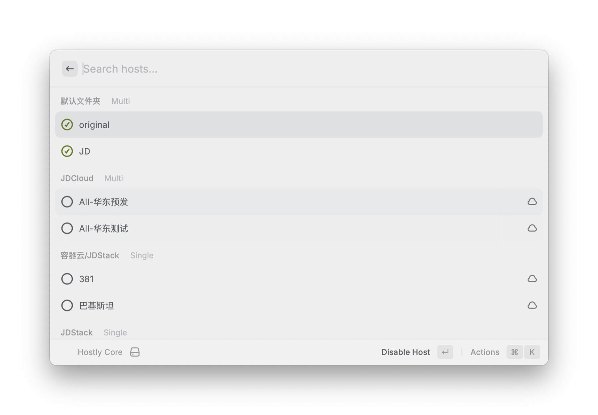

# Hostly Raycast Extension (Local)

这是一个本地 Raycast 插件，用于调用 `hostly` 命令管理 Host 配置。



## 功能

- 调用 `hostly list`，按文件夹展示 Host 列表
- 快速启用/关闭配置（内部调用 `hostly open <name>` / `hostly close <name>`）
- 支持刷新列表（`Cmd + R`）

## 安装方式（本地开发源）

1. 下载raycast插件
   1. 从 https://github.com/imshenshen/Hostly/releases/tag/releases 中下载 hostly-raycast-extension.zip
   2. 或者进入本项目的 `raycast` 构建插件
       ```bash
       cd raycast
       npm install
       npm run build
      ``` 
1. 打开 Raycast
2. 输入 `Import Extension...`
3. 选择目录：`raycast/dist`
4. 导入后运行命令：`hostly core`

## 从 Release 构建包导入

发布流程会产出 `hostly-raycast-extension.zip`，解压后根目录即为可导入插件目录（包含 `package.json` 和 `hostly-core.js`）。

导入步骤：

1. 下载并解压 `hostly-raycast-extension.zip`
2. 打开 Raycast，输入 `Import Extension...`
3. 选择解压后的目录（根目录）
4. 导入后运行命令：`hostly core`

## 配置

- `Hostly Binary Path`
  - 可选覆盖路径，填写 `hostly` 可执行文件绝对路径
  - 不填时默认使用：`/Applications/Hostly.app/Contents/MacOS/hostly-core`

## 使用说明

1. 在 Raycast 输入并打开 `hostly core`
2. 在列表中查看各文件夹下的 Host 项
3. 选中某一项后执行动作：
   - `Enable Host`：启用
   - `Disable Host`：关闭
4. 使用 `Cmd + R` 可刷新最新状态

## 常见问题

- 导入失败提示缺少 `icon`：
  - 确认目录下存在 `icon.png`，且 `package.json` 中有 `"icon": "icon.png"`

- 已导入但图标不显示：
  - 先在 Raycast 中移除该本地插件，再重新 `Import Extension...`
  - 确认导入的是包含 `package.json`、`hostly-core.js`、`icon.png` 的目录

- 提示找不到 `hostly-core`：
  - 确认应用已安装在 `/Applications/Hostly.app`
  - 或在插件偏好里填写 `Hostly Binary Path` 指向你的实际可执行文件路径

- 报错 `Could not find command's executable JS file`：
  - 通常是导入了错误目录
  - 本地开发请导入 `raycast/dist`
  - Release 包请导入解压后的根目录（不要再进入子目录）
